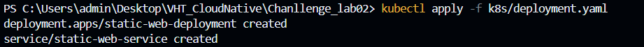

# Static Web Deployment on Kubernetes

Các bước triển khai ứng dụng web tĩnh trên Kubernetes sử dụng Nginx.

## Prerequisites

1. **Docker Desktop/Docker Engine**
   - Install Docker
   - Have Docker Hub account

2. **Kubernetes**
   - Minikube
   - kubectl

## Implementation Steps

1. **Build Docker image**
docker build -t hiumonday/static-web:v1 .
docker push hiumonday/static-web:v1

3. **Start Minikube**
minikube start

4. **Deploy to Kubernetes**
kubectl apply -f k8s/deployment.yaml

5. **Check deployment**
# Check pods
kubectl get pods -o wide

# Check service
kubectl get services

6. **Access website**
# Get Minikube IP
minikube ip

# Access web via browser
http://<minikube-ip>:30080

## Troubleshooting

1. **Check logs**
kubectl logs <pod-name>

2. **Check pod details**
kubectl describe pod <pod-name>

3. **Access container**
kubectl exec -it <pod-name> -- /bin/bash

