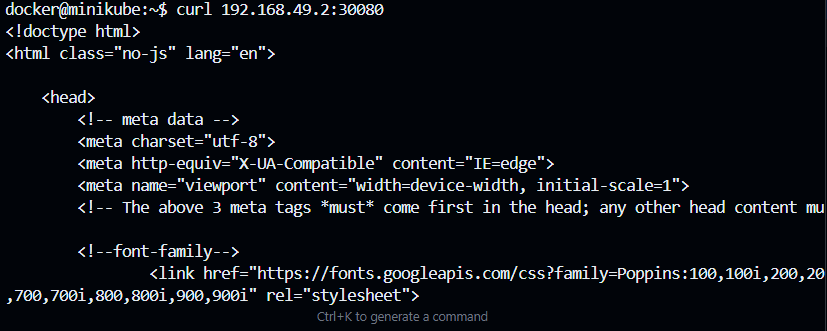

# Cloud Computing Lab Challenges
# Prerequisites
- Docker Desktop/Engine
- Minikube (Optional)
- kubectl
- Git

## Challenge Lab 01: Basic Nginx

### Steps

1. **Write file nginx-demo.yaml**

2. **Deploy to Kubernetes**
  - kubectl apply -f nginx-demo.yaml

3. **Result**
    - NOTE: docker-desktop context automatically maps localhost to the Kubernetes cluster
        - Access via nodePort 

        

    - Curl to nodePort (context=minikube)

        - -> run: minikube start 
        - -> and deploy to Kubernetes again

        
        

## Challenge Lab 02: Static Web Deployment

### Steps
1. **Copy Static Website to /website**

2. **Create nginx.conf in /nginx-config**

3. **Create Dockerfile and deployment.yaml in folder /k8s**
   
4. **Build & Push Docker Image**
   - docker build -t hiumonday/static-web:v1 .
   - docker push hiumonday/static-web:v1

5. **Deploy to Kubernetes**
   - kubectl apply -f k8s/deployment.yaml

6. **Result**
    - NOTE: docker-desktop context automatically maps localhost to the Kubernetes cluster
        - Access via nodePort 
        
    - Curl to nodePort (context=minikube)
        - -> run: minikube start 
        - -> and deploy to Kubernetes again
        

## Challenge Lab 03: Nginx Proxy Multi Server

### Steps
1. **Create Folfer /web1 & /web2 **

2. **Create nginx-proxy Config**

3. **Build & Push Images**
   # Build web1
   - cd web1
   - docker build -t hiumonday/web1 .
   - docker push hiumonday/web1

   # Build web2
   - cd ../web2
   - docker build -t hiumonday/web2 .
   - docker push hiumonday/web2

   # Build nginx-proxy
   - cd ../nginx-proxy
   - docker build -t hiumonday/nginx-proxy .
   - docker push hiumonday/nginx-proxy

4. **Deploy to Kubernetes**
   - cd /Challenge_lab03
   - kubectl apply -f ./k8s
   

5. **Result**
    - Default page http://localhost:30090/

    

    - Access web1

    

    - Access web2

    
